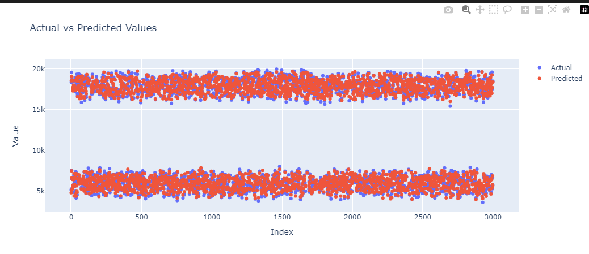
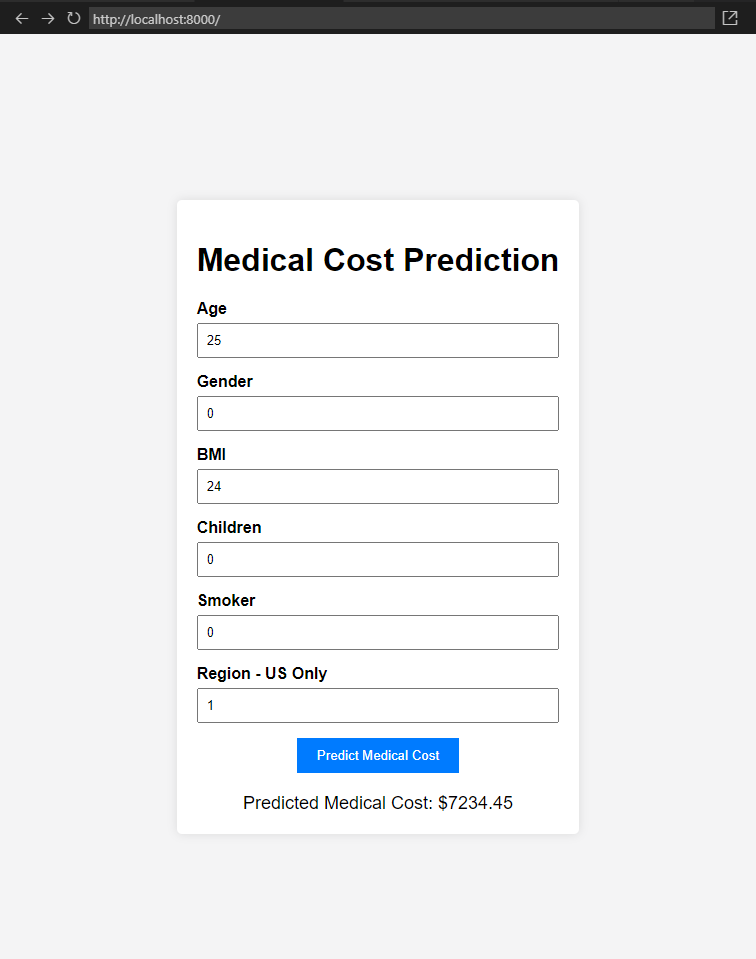
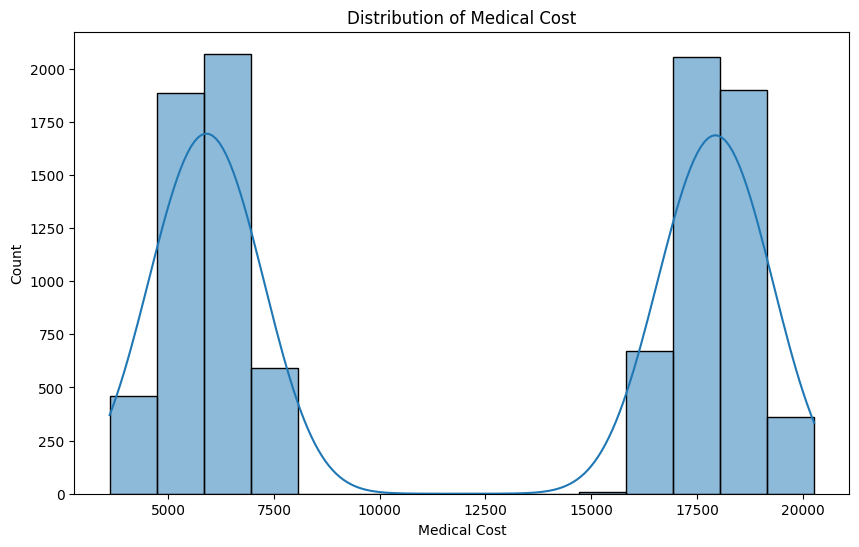
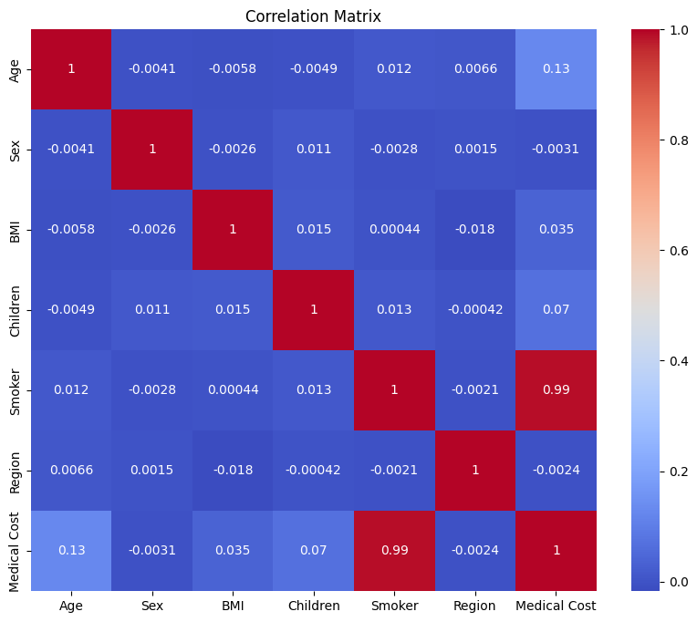
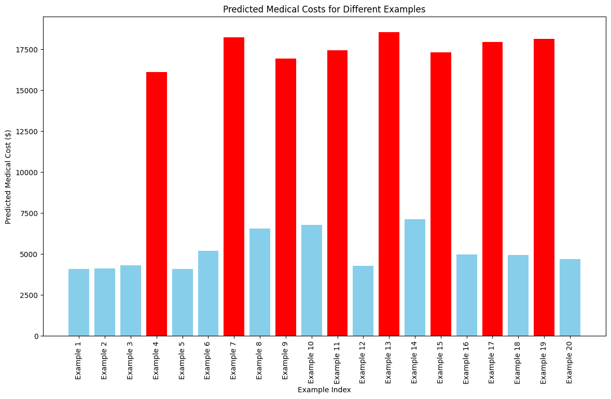

# Medical Cost Prediction

The purpose of this project was to check for correlation and prediction possibility for a medical dataset.

The dataset used is available on [Kaggle](https://www.kaggle.com/datasets/waqi786/medical-costs):
"This dataset contains detailed information about medical costs for individuals over the period from 2010 to 2020. It includes various attributes such as age, sex, BMI, number of children, smoking status, and region. These attributes are essential in understanding the factors that influence medical costs and can be used for predictive modeling, statistical analysis, and research purposes."

## Data Analysis

First, I analyzed the data to check for the distribution and split of the different features.

## Model Training and Initial Results

Using my GPU alongside the `XGBRegressor` model, I trained and tested a model. The initial results seemed promising:

- **Mean Absolute Error:** 255.77
- **Mean Squared Error:** 87840.26
- **R-squared:** 0.998



## Model Deployment

After this, I transitioned from the Jupyter notebook to two scripts:

- `train_model.py`
- `predict_cost.py`

The role of these two files is to train the model and then predict the cost with minimal configuration. The `predict_cost.py` script also includes user input fields, which would later assist us when creating a Flask back-end with an HTML front-end.

In `app.py` and `index.html`, you can see the Flask back-end connected to the front end.

The web server can be started by typing:

\```bash
python -m http.server
\```

The end result looks like this:



## Model Bias and Sensitivity Analysis

However, I noticed a large bias against smokers. While this is logical, I wanted to ensure there were no mistakes during model training. I created a balanced version to address this concern. Additionally, the model seemed to be very biased towards numbers between 6k and 8k and 16k to 20k, with nothing in between.

A simple distribution chart revealed the bias:



The correlation heatmap shows that smoking status has a significant impact on medical costs:



Understanding that the sampling method might introduce bias, I fed the model some random values to test its sensitivity. The ones in red signal that the person is a smoker. While age, BMI, number of children, and region have an impact, their influence is much smaller compared to smoking status.


